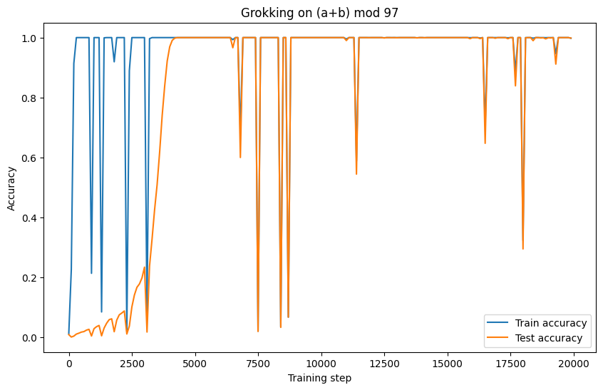
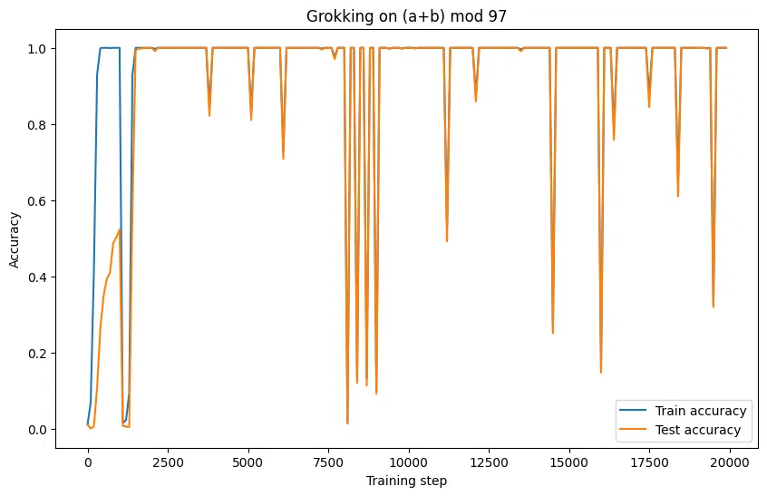
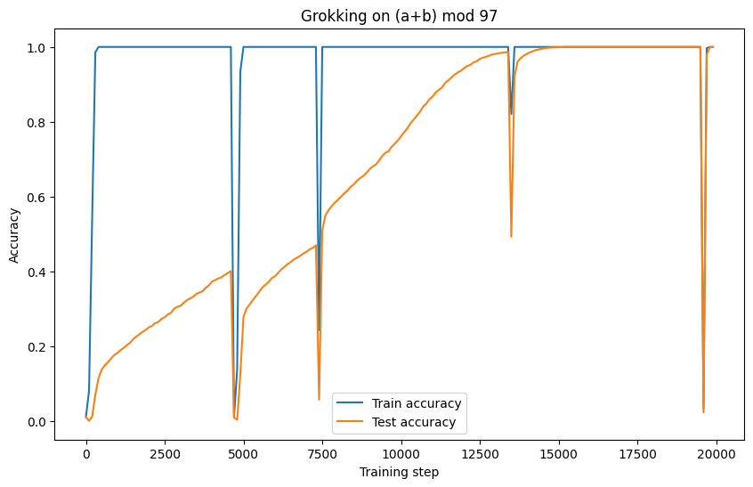
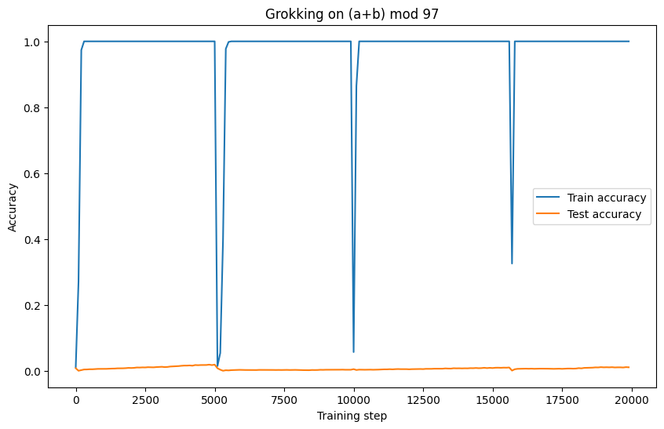

# Reproducing Grokking: Delayed Generalization in a Tiny Transformer

A small-scale reproduction of the "grokking" phenomenon from Power et al.
(2022), *"Grokking: Generalization Beyond Overfitting on Small Algorithmic
Datasets"* ([arXiv:2201.02177](https://arxiv.org/abs/2201.02177)), with a
2×2 ablation over weight decay and training data fraction.

## What is grokking?

Grokking is a surprising training dynamic: a model reaches ~100% **training**
accuracy almost immediately, then sits at near-random **test** accuracy for
a long stretch of additional training — sometimes thousands of steps — before
suddenly, sharply generalizing to the held-out data. It challenges the
intuition that a flat training loss means training is "done": something is
still reorganizing inside the network well after the loss curve looks
finished.

## Setup

- **Task:** modular addition, `(a + b) mod 97`
- **Data:** all 97×97 = 9,409 possible `(a, b)` pairs, split into train/test
- **Model:** a small decoder-only Transformer (2 layers, 128-dim embeddings,
  4 attention heads) — same architecture family as GPT-style models
  (self-attention + residual connections + LayerNorm), scaled down
- **Training:** AdamW optimizer, trained far past the point where training
  accuracy saturates (20,000 steps), logging train/test accuracy every 100
  steps

Full implementation in [`grokking.py`](grokking.py).

## Experiment: does weight decay × data fraction interact?

The original paper emphasizes that weight decay is important for grokking
to occur. I ran a small 2×2 grid over two hyperparameters to see how sensitive the effect actually is:

| | **Train fraction = 0.3** | **Train fraction = 0.5** |
|---|---|---|
| **Weight decay = 1.0** | Grokking occurs, but with frequent instability (repeated dips throughout training) | Rapid, near-simultaneous train/test generalization — little visible "delay" |
| **Weight decay = 0.1** | **No generalization at all** — test accuracy stays near 0% for the full 20,000 steps | Clean, textbook grokking curve — clear delay (~4,000 steps) before test accuracy catches up |

### Plots

**Weight decay = 1.0, fraction = 0.3** — delayed generalization occurs, but
training is unstable, with the model repeatedly dipping and recovering:



**Weight decay = 1.0, fraction = 0.5** — train and test accuracy rise
together almost immediately; the classic "delay" is barely visible at this
data fraction:



**Weight decay = 0.1, fraction = 0.5** — the cleanest reproduction of the
paper's core result: training saturates almost immediately, test accuracy
climbs slowly, and catches up after a clear delay of several thousand steps:



**Weight decay = 0.1, fraction = 0.3** — generalization fails entirely
within the training budget; test accuracy never rises above chance level:



## Key finding

**Weight decay and training-data fraction trade off against each other,
rather than acting independently.** Neither hyperparameter alone reliably
predicts whether — or how cleanly — grokking occurs:

- With **more data** (fraction 0.5), a **gentler** weight decay (0.1)
  produces the cleanest, most paper-faithful grokking curve.
- With **less data** (fraction 0.3), that same gentle weight decay
  **completely fails** to generalize — the model needs a much stronger
  weight decay (1.0) to eventually find the generalizing solution, at the
  cost of a much noisier, less stable training trajectory.

This suggests weight decay's role isn't simply "helps generalization" in an
absolute sense — it appears to act as a kind of regularization pressure that
can substitute for missing data, but only up to a point, and with a
stability cost.

## Limitations

- **Single run per configuration.** No repeated seeds, so it's possible some
  of the observed instability (the periodic dips) is run-specific noise
  rather than a deterministic property of each hyperparameter setting. A
  more rigorous version of this experiment would average over 3+ seeds per
  cell.
- **One task only.** All results are specific to modular addition; the
  paper studies several other algorithmic tasks, which may behave
  differently under the same hyperparameter grid.
- **Small grid.** Only two values tested per hyperparameter (0.1/1.0 for
  weight decay, 0.3/0.5 for fraction) — the actual relationship between
  these variables is likely more continuous than this coarse grid can show.

## Repository structure

```
.
├── grokking.py          # full implementation: model, data, training loop
├── plots/                # accuracy curves for each of the 4 configurations
└── README.md
```

## Reference

Power, A., Burda, Y., Edwards, H., Babuschkin, I., & Misra, V. (2022).
*Grokking: Generalization Beyond Overfitting on Small Algorithmic Datasets.*
[arXiv:2201.02177](https://arxiv.org/abs/2201.02177)
